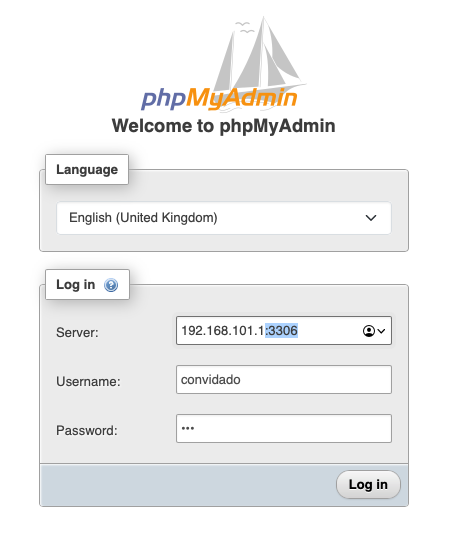
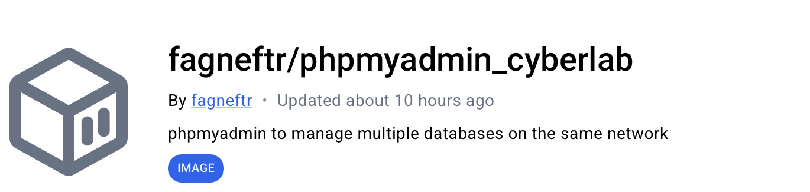

# phpMyAdmin for Cyber Labs

# Quick Start

```bash
docker run --name dbadmin -d -p 443:443 fagneftr/phpmyadmin_cyberlab:latest
```

Afterwards, open the login page in the web browser: [https://127.0.0.1](https://127.0.0.1/)

You can change the host and port of the server using the **`<IP_HOST>:<PORT>`**

* **Note:** If IP_HOST is set to the local address (127.0.0.1), the container will attempt to connect to itself.



## Docker Hub Repository [fagneftr/phpmyadmin_cyberlab](https://hub.docker.com/r/fagneftr/phpmyadmin_cyberlab)




# Building the Image

You can edit [Dockerfile](./Dockerfile) and [compose.dev.yaml](./compose.dev.yaml) and recompile the image using:

```c
docker compose -f compose.dev.yaml up -d --build
```

* **Note:**  This image was compatible with all environment variables of the base image [phpmyadmin oficial repository](https://hub.docker.com/_/phpmyadmin)
